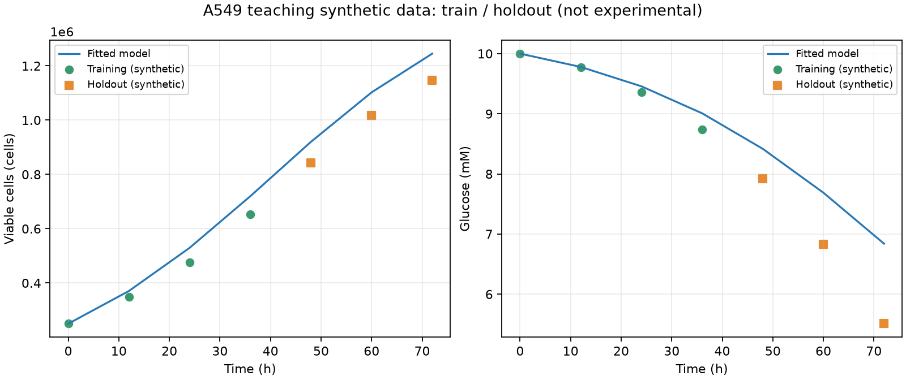

# e-cell · Virtual Cell Simulator

**面向贴壁细胞培养条件探索的、文献驱动的经验动力学研究原型。** e-cell 将培养环境、群体生长/死亡、代谢物趋势、CSV 对齐、误差评估和透明粗校准放在同一交互界面中，服务于细胞培养教学、实验设计讨论与模型假设检查。

> 当前阶段：研究原型。它不是经独立实验验证的数字孪生、临床决策工具或湿实验替代品。

[](https://www.python.org/) [](https://streamlit.io/) [](LICENSE)

**在线 Demo：** `待部署`。仓库尚未提供可核验的公开 Streamlit 地址；部署后请在此处替换为实际 URL。

| 细胞培养模式 | 教学与机制探索模块 |
| --- | --- |
|  |  |
| 群体动力学、环境操作、实测 CSV 对齐与导出。 | 细胞器结构与相对状态指数，仅用于教学和机制探索。 |

## 项目解决什么问题

- **适用对象：** 需要讨论贴壁细胞培养条件、采样计划或模型假设的学生、导师和研究人员。
- **核心能力：** HeLa、HEK-293、A549 的经验培养动力学；葡萄糖/谷氨酰胺/乳酸/氧/pH 等环境趋势；实测 CSV 对齐；MAE、RMSE；`growth_scale` 与 `uptake_scale` 的透明网格粗校准；实验事件、场景 JSON、配置快照与质量控制元数据导出。
- **不做什么：** 不估计患者结局、临床疗效或真实细胞器浓度；不替代细胞计数、代谢分析、污染检测、统计推断或独立湿实验验证。

## 30 秒快速开始

```bash
git clone https://github.com/umasouno2007-design/virtual-cell-simulator.git
cd virtual-cell-simulator
python -m venv .venv
```

激活虚拟环境后安装并启动：

```bash
# Windows PowerShell
.\.venv\Scripts\Activate.ps1

# macOS / Linux
source .venv/bin/activate

pip install -r requirements.txt
streamlit run app.py
```

浏览器打开终端显示的本机地址，通常为 <http://localhost:8501>。若端口被占用，Streamlit 会显示可用的替代端口。

## 核心工作流

1. 选择细胞系、培养体积、面积、场景和环境条件。
2. 推进模拟或记录计划操作；导出事件时间线和实验配置快照。
3. 在“细胞培养”模式导入实测 CSV，查看模拟—实测叠加、逐点残差、MAE 与 RMSE。
4. 仅在起点和条件一致时运行两参数粗校准；建议值只影响后续模拟，历史不会被改写。
5. 在“实验元数据与质量控制”中记录来源、传代数、STR、支原体、培养基/血清批次；这些信息不参与模型计算，也不等于样本合格。
6. 在“参数敏感性与不确定性分析”中查看未校准生长/摄取先验的单因素情景差异，并下载逐时 CSV；情景范围不是置信区间。
7. 在“实验场景：导入、导出与复现”中下载或载入 JSON 场景；它只记录模拟假设，不嵌入原始 CSV，也不构成审计追踪。

### 教学与机制探索模块

“细胞生命活动”保留 3D 细胞器地图、CellDex、ATP、ROS、膜电位、DNA 损伤、ER 应激、自噬、凋亡与周期的**相对功能指数**。它们帮助解释培养环境与细胞状态的教学性关系；不对应 ATP 浓度、膜电位 mV、自噬通量、损伤灶计数或细胞周期实测比例。

## 可复现验证案例

仓库包含 `data/a549_teaching_synthetic.csv`：这是**教学合成数据**，不是公开真实实验数据、外部验证数据或患者数据。它用于检验软件工作流能否以固定时间切分完成“训练点粗校准—留出点评估—图形与指标导出”。因此，它只能证明评估管线可运行，不能证明 A549 模型已被生物学验证。

```bash
python scripts/validate_a549_teaching_case.py
```

脚本固定使用 0、12、24、36 h 为训练点，48、60、72 h 为留出验证点；复用应用中的 `fit_growth_and_uptake` 和模拟—实测对齐逻辑，输出以下文件到 `assets/validation/a549_teaching_case/`：

- `a549_training_holdout.png`：活细胞数与葡萄糖的模拟/训练/留出曲线；
- `training_metrics.csv`、`validation_metrics.csv`：逐指标 MAE、RMSE；
- 对齐结果 CSV 与 `summary.json`：拟合参数、时间切分和数据来源。

当前固定教学案例的透明结果为：`growth_scale=1.7`、`uptake_scale=3.0`，训练集活细胞数 MAE 约 35,175 cells、验证集约 86,746 cells；验证集葡萄糖 MAE 约 0.896 mM。摄取率达到预设搜索上界，说明当前经验模型与该合成轨迹并不完全吻合；这应被视作“需要更多参数化或真实数据校准”的信号，而非模型准确性的证明。



真实数据列格式、单位、来源要求和隐私边界见 [data/README.md](data/README.md)。

## 参数敏感性与不确定性

培养模式中的“参数敏感性与不确定性分析”从**当前培养状态**出发，逐项扫描群体倍增时间、生长速率缩放和代谢摄取缩放的低/基准/高情景，比较未来 12–168 h 的活细胞数、存活率、葡萄糖、乳酸与 pH，并提供 CSV 和趋势图。倍增时间仅有细胞库中心值，±20% 是教学情景；两个缩放参数是待校准先验。基础死亡率、氧传递、缓冲容量、乳酸生成率和承载密度没有可通用外推的范围，因而被列为待实验测定，未被伪造为“置信区间”。

所有敏感性结果只回答“在所列假设情景下，输出会如何变化”，不代表参数后验分布、置信区间或实验验证。

## 数据质量、校准与场景复现

实测 CSV 导入后会产生最低建模条件报告：时间、重复点、缺失/负值、指标可用性和留出点可行性被区分为“阻止继续”“可继续但需警告”和“通过”。通过只代表格式和最低建模条件合格，**不是实验质量认证，也不证明生物学结论有效**。应用提供标准化副本下载，但不会静默修改或覆盖原始文件。最小数据格式和常见错误见 [data/README.md](data/README.md)。

粗校准保留 `growth_scale` × `uptake_scale` 的透明网格搜索，并显示归一化误差表面、指标权重、最佳点与接近最佳区域。权重仅是可解释的指标优先级；没有留出数据时只能报告拟合误差。搜索边界最优、时间点太少、初始条件不一致或系统残差均意味着不能将结果解释为可靠校准。

场景格式与单位见 [SCENARIO_FORMAT.md](SCENARIO_FORMAT.md)，最小样例见 [data/example_a549_scenario.json](data/example_a549_scenario.json)。在同一模型版本下，导入后从相同初始状态运行应在浮点误差范围内复现；它仍不是 GLP/GMP 审计记录、原始实验记录或临床文件。

## 科学边界与证据等级

| 机制 | 当前关系 | 证据等级 | 限制 |
| --- | --- | --- | --- |
| 细胞系与基础培养条件 | 细胞库条件、温度、CO₂、培养基和倍增时间先验 | A / B | 批次、传代与实验室条件会改变结果。 |
| 增殖与死亡 | `μmax = ln(2) / doubling_time`，并叠加环境修正 | A / B | 群体平均经验近似，不代表单细胞异质性。 |
| 葡萄糖、谷氨酰胺、乳酸、氧与 pH | 简化物料衡算、摄取/生成率与一阶氧传递 | B | 摄取率和阈值必须用同体系数据校准。 |
| 药物浓度 | Hill/IC50 经验浓度—效应项 | A / B | 只有同细胞系、终点和暴露时间的参数才可解释。 |
| 细胞内状态/细胞器 | 环境驱动的相对指数和可视化反馈 | C | 教学与机制探索，不是定量细胞器测量。 |

证据等级：**A** 为直接来源支持；**B** 为方向有文献依据、数值待校准的先验；**C** 为帮助交互和趋势理解的演示规则。完整来源及公式说明在应用的“参数来源与可追溯性”中展示。

关键来源：[ATCC A549 CCL-185](https://www.atcc.org/products/ccl-185)、[Cellosaurus A-549 CVCL_0023](https://www.cellosaurus.org/CVCL_0023)、[哺乳动物细胞培养宏观建模综述](https://pmc.ncbi.nlm.nih.gov/articles/PMC4536272/)、[培养环境控制最佳实践](https://pubmed.ncbi.nlm.nih.gov/35265608/)、[ATCC 细胞系鉴定建议](https://www.atcc.org/resources/technical-documents/cell-line-authentication-test-recommendations)。

## 开发与测试

```bash
python -m unittest discover -s tests -p "test_*.py"
python scripts/smoke_check.py
```

GitHub Actions 会在 push 和 pull request 上安装固定范围的依赖，并运行测试与部署前 smoke check。依赖范围见 [requirements.txt](requirements.txt)；本地运行推荐 Python 3.11 或 3.12。模型版本、用途、证据边界、已知失败模式和版本升级原则见 [MODEL_CARD.md](MODEL_CARD.md) 与 [CHANGELOG.md](CHANGELOG.md)；界面呈现规则见 [UI_STYLE_GUIDE.md](UI_STYLE_GUIDE.md)。

## 项目结构

```text
app.py                   Streamlit 界面、导出与交互
cell.py / simulation.py  贴壁细胞经验动力学与培养操作
calibration.py           两参数透明网格粗校准
experiment_data.py       CSV 标准化、对齐、残差、MAE/RMSE
data_quality.py          最低建模条件检查与可下载报告
scenario.py              可读 JSON 场景的校验、导入与导出
version.py               唯一模型版本与场景格式版本
data/                    教学示例数据与数据治理说明
scripts/                 可重复运行的验证案例
tests/                   模型、数据、界面状态与案例测试
assets/                  本地视觉资源、截图与验证图
sensitivity.py           单因素先验情景敏感性分析
reproduction/            教学性论文复现可行性审查（当前不伪造数据）
```

## 部署、引用与许可证

- 部署步骤见 [DEPLOYMENT.md](DEPLOYMENT.md)。请勿将私密实验、患者资料、令牌或 `.streamlit/secrets.toml` 推送到公开仓库。
- 引用本项目请使用 [CITATION.cff](CITATION.cff)。其中作者姓名保留了可编辑占位符，发布前请替换为偏好的署名；未声明 DOI、论文发表或外部验证。
- 本项目使用 [MIT License](LICENSE)。第三方来源、证据与限制须随再分发保留。
- 真实协作数据建议使用 [EXPERIMENT_PROTOCOL_TEMPLATE.md](EXPERIMENT_PROTOCOL_TEMPLATE.md) 记录；真实验证数据必须有可追溯来源，并预先留出独立验证集。
- 风险覆盖、未覆盖风险与测试方式见 [QUALITY.md](QUALITY.md)；教学性论文复现审查见 [REPRODUCTION_PLAN.md](REPRODUCTION_PLAN.md)；GitHub 展示文案见 [PROJECT_PITCH.md](PROJECT_PITCH.md)。

## 中文简历表述（可直接使用）

- 开发面向贴壁细胞培养条件探索的 Streamlit 研究原型，使用经验动力学建模环境、增殖、死亡与代谢物趋势，输出可交互的培养模拟与实验事件记录。
- 实现实测 CSV 标准化、模拟—实测时间对齐、MAE/RMSE 评估及两参数透明网格粗校准，并构建 A549 教学合成数据的训练—留出验证脚本与可视化产物。
- 构建细胞器教学与机制探索界面、质量控制元数据及可导出配置快照；明确其不替代湿实验、定量检测或临床判断。
