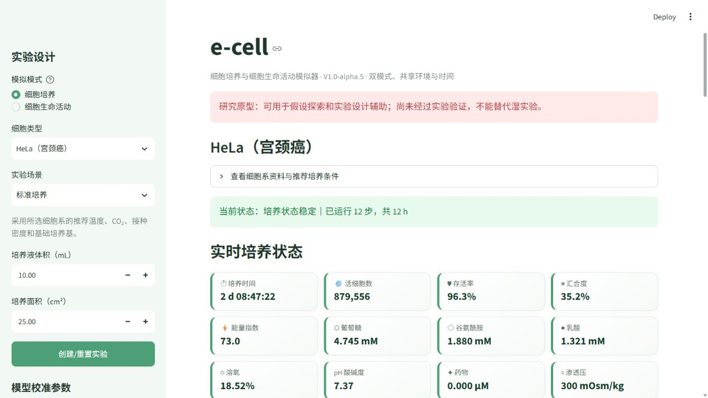
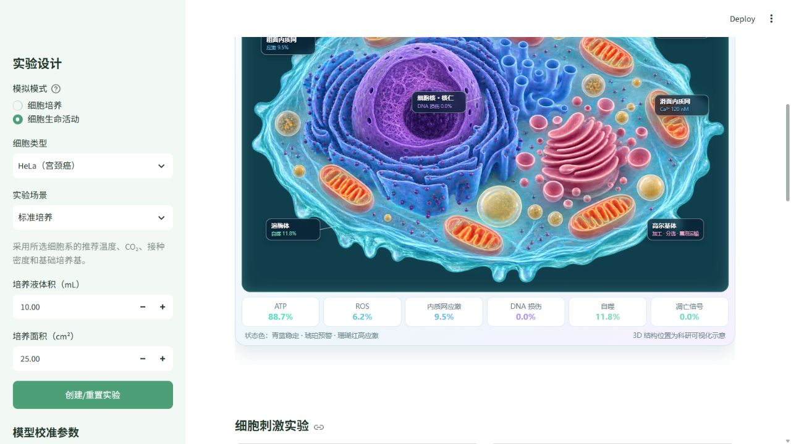

# e-cell

e-cell V1.0-alpha.5 是一个**文献驱动、使用真实单位、可用实验数据校准**的虚拟细胞研究原型。界面包含“细胞培养”和“细胞生命活动”两个模式；它适合探索实验假设，但在完成参数拟合与独立验证前，不能替代湿实验或作为定量实验结论。

## 两种模拟模式

- **细胞培养**：观察群体生长、死亡、汇合度、营养消耗和培养环境。
- **细胞生命活动**：以代表性单细胞为视角，观察细胞核、线粒体、内质网、高尔基体、溶酶体和核糖体，以及 ATP、ROS、Ca²⁺、DNA 损伤、细胞周期、自噬与凋亡信号。

两个模式共享培养环境和连续时钟。氧、葡萄糖、pH、温度、药物和汇合度会影响细胞内部状态；后者再用于解释群体生长或死亡背后的机制。

### 3D 细胞生命活动视图

细胞生命活动模式使用可离线加载的 3D 生物医学真核细胞剖面图，展示半透明细胞膜与细胞质、细胞核和核仁、线粒体及其嵴、粗面/滑面内质网、高尔基体、溶酶体、运输囊泡与游离核糖体。

网页浮层会随模拟状态更新：

- 线粒体标签显示膜电位，并用动态光晕表示功能水平；
- 细胞核显示细胞周期和 DNA 损伤；
- 内质网、溶酶体分别显示内质网应激、Ca²⁺ 与自噬水平；
- ATP、ROS、自噬和凋亡信号显示实时数值；
- ROS、DNA 损伤、内质网应激或凋亡升高时，状态色由青蓝切换为琥珀或珊瑚红。

所有标签均由网页实时叠加，3D 底图本身不包含文字或水印。

## 运行截图

### 细胞培养模式



实时显示细胞数量、存活率、汇合度、培养环境和代谢指标。

### 细胞生命活动模式



3D 细胞剖面、细胞器浮层标签与 ATP、ROS、DNA 损伤、自噬和凋亡状态联动。

## 当前支持的细胞系

- HeLa（宫颈癌细胞系）
- HEK-293（人胚肾来源转化细胞系）
- A549（肺腺癌细胞系）

每种细胞系分别保存推荐培养基、血清、温度、CO₂、接种密度、承载密度、群体倍增时间和代谢速率先验。界面会明确显示哪些数值来自细胞库，哪些只是等待校准的初始先验。

## 模型内容

- 时间：小时（h）
- 活细胞数、死细胞数、存活率与汇合度
- 葡萄糖和乳酸：mM
- 氧：培养环境/溶氧代理百分比
- 温度：°C
- CO₂：%
- pH
- 渗透压：mOsm/kg
- 药物浓度：µM
- 药物 IC50 与 Hill 系数
- 生长、死亡、营养消耗、乳酸生成、氧传递、接触抑制和换液
- 带单位的 CSV 数据导出

## 数学结构

最大比生长率由群体倍增时间换算：

```text
μmax = ln(2) / doubling_time
```

实际生长率由葡萄糖、氧、pH、温度、渗透压、乳酸、药物与汇合度修正。葡萄糖和氧采用 Monod 型饱和项，药物采用 Hill/IC50 抑制项，贴壁细胞使用承载密度描述接触抑制。代谢物按细胞数、培养液体积和时间积分。

## 安装和运行

需要 Python 3.10 或更高版本：

```powershell
cd "C:\Users\umaso\Documents\Codex\e-cell\virtual_cell_v1.0-alpha"
python -m venv .venv
.\.venv\Scripts\python.exe -m pip install -r requirements.txt
.\.venv\Scripts\streamlit.exe run app.py
```

启动后在浏览器访问：

```text
http://localhost:8501/
```

如果已经安装依赖，也可以直接运行：

```powershell
pip install -r requirements.txt
streamlit run app.py
```

在 Pad 上使用时，建议把 GitHub 仓库部署到 Streamlit Community Cloud，再用浏览器访问网页。

## 文件结构

```text
e-cell/
├── app.py                 # Streamlit 界面、图表和数据导出
├── cell.py                # 生长、死亡、代谢和药物动力学
├── intracellular.py       # 细胞器功能、应激、周期和命运状态
├── profiles.py            # 细胞系参数、来源和置信状态
├── simulation.py          # 场景、运行控制和状态判定
├── requirements.txt       # 依赖
├── README.md              # 本说明
├── DEPLOYMENT.md          # 部署说明
└── tests/
    ├── test_cell.py       # 培养模型测试
    ├── test_intracellular.py # 细胞内部模型测试
    └── test_app.py        # 界面状态测试
```

## 参数来源

- [ATCC HeLa CCL-2](https://www.atcc.org/products/ccl-2)：EMEM + 10% FBS、37°C、5% CO₂、贴壁培养和传代建议。
- [ATCC HEK-293 CRL-1573](https://www.atcc.org/products/crl-1573)：EMEM + 10% FBS、37°C、5% CO₂、接种密度和培养建议。
- [ATCC A549 CCL-185](https://www.atcc.org/products/ccl-185)：F-12K + 10% FBS、37°C、5% CO₂、培养密度及约 22 h 群体倍增时间。
- [Warburg-associated acidification represses lactic fermentation](https://pmc.ncbi.nlm.nih.gov/articles/PMC10584866/)：支持低 pH 对 HEK/HeLa 糖酵解和乳酸生成的抑制关系。
- [Preliminary studies of cell culture strategies for HEK293 cells](https://pmc.ncbi.nlm.nih.gov/articles/PMC3980760/)：提供 HEK293 培养、生长、葡萄糖、乳酸和溶氧控制资料。

## 实验使用前必须完成

1. 明确细胞株来源、传代数、培养基品牌/批次、血清批次和培养器皿。
2. 采集多个时间点的活细胞数、存活率、葡萄糖、乳酸、pH 和溶氧数据。
3. 至少使用 3 个生物学重复估计误差。
4. 拟合 `growth_scale`、`uptake_scale`、死亡率、氧传递和缓冲参数。
5. 若模拟药物，必须使用该药物在同一细胞系和相近实验条件下的 IC50/Hill 数据。
6. 使用没有参与拟合的独立实验批次验证，并报告 RMSE、偏差和置信区间。
7. 进行细胞身份认证（如 STR）和支原体检测。

## 当前限制

- 当前是经验动力学模型，不是全基因组代谢模型，也不是 PBPK/QSP 模型。
- 代谢摄取率与部分倍增时间是等待校准的先验，不是通用常数。
- 细胞内部模型目前是功能指数模型，尚未表示具体基因网络、化学计量代谢网络、三维扩散、基质或克隆异质性。
- 不能用于临床判断、人体给药、诊断或替代真实实验。

## 下一阶段

- 导入用户实验 CSV 并自动拟合参数、计算置信区间
- 添加更多细胞系和 Cellosaurus/ATCC 标识符
- 增加传代、接种、部分换液和采样事件时间表
- 为具体药物建立细胞系特异性的剂量—反应模型
- 加入谷氨酰胺、氨、ROS、细胞周期与凋亡状态
- 在有足够数据后增加 3D 球体扩散或代谢网络模型
