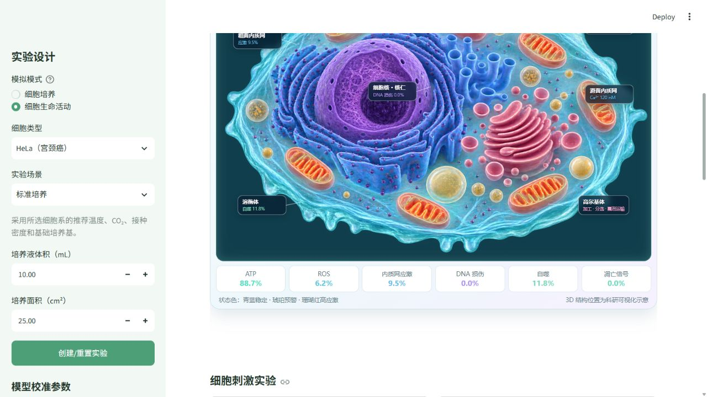
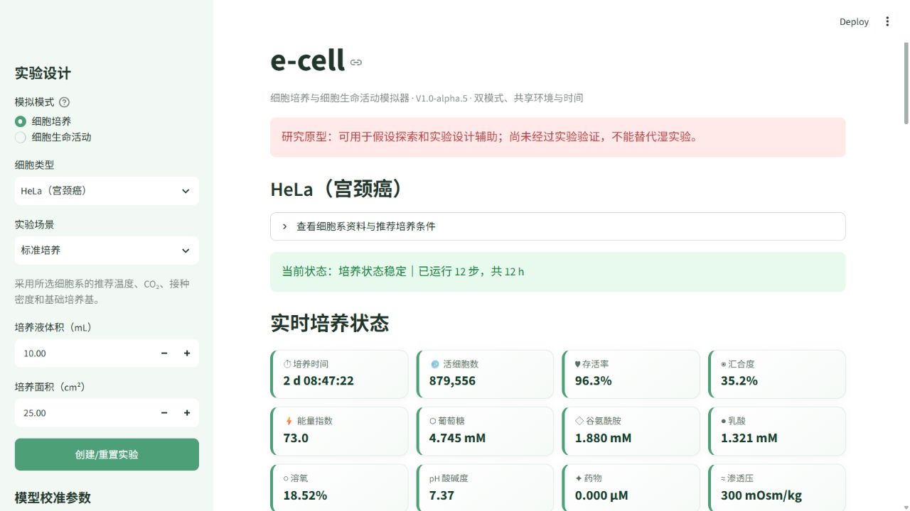

# e-cell · Virtual Cell Simulator

**面向代表性单细胞与小型细胞群生命状态探索的、文献驱动经验动力学研究原型。**

当前阶段：用于教学、实验设计讨论和模型假设检查；尚未完成独立实验验证。它不是数字孪生、临床工具、湿实验替代品或细胞器定量测量系统。

| 单细胞实验室 | 培养环境与数据工作流 |
| --- | --- |
|  |  |
| 代表性单细胞的相对状态、时间轨迹与机制解释。 | 配置培养条件、推进模拟、对齐实测 CSV 与导出。 |

**Online demo：** [打开公开 Demo](https://virtual-cell-simulator-fdnviedwcau9avnk8e69j9.streamlit.app/)。该站点展示研究原型与教学合成数据，不代表独立实验验证。

## 30 秒启动 / Quick start

```bash
git clone https://github.com/umasouno2007-design/virtual-cell-simulator.git
cd virtual-cell-simulator
python -m venv .venv

# Windows PowerShell
.\.venv\Scripts\Activate.ps1

# macOS / Linux：source .venv/bin/activate
pip install -r requirements.txt
streamlit run app.py
```

浏览器通常访问 <http://localhost:8501>；如端口被占用，请使用终端显示的地址。

## 研究问题与适用范围

e-cell 以“培养微环境 → 代表性单细胞状态 → 3–50 个代表性细胞的微型群体 → 可选培养汇总”为组织结构。培养动力学、数据质量、CSV 对齐与透明校准仍完整保留，作为环境输入和数据工作流支撑。当前预设为 A549、HeLa、HEK-293；预设不等于任何批次、传代数或实验室条件的验证。

## 核心工作流

1. 在“单细胞实验室”设置局部氧可用性代理、葡萄糖、乳酸、pH、温度、药物与拥挤程度，观察代表性细胞的相对状态轨迹及相邻记录的描述性变化率；可显式载入培养工作流的当前环境。变化率不是实验测量或统计估计。顶部上下文栏分别读取当前模式自己的模拟时钟与适用的数据/校准状态。
2. 在“微型细胞群”观察 3–50 个代表性细胞的初始异质性、单细胞轨迹、状态子群标签计数与比例时间序列、局部应激信号和可选通信对照；新生成的每个状态点均记录通信开关状态。比例仅描述代表性细胞集合；历史窗口不完整时，按该时点实际保留的细胞记录计算，不代表真实培养群体构成。
3. 在“培养环境与数据工作流”推进经验培养模拟，记录事件，导入实测 CSV 并查看对齐、残差、MAE 与 RMSE。
4. 使用 `growth_scale` 与 `uptake_scale` 的透明网格搜索作参数初值探索；结果不构成统计推断。
5. 导出结果、事件、质量报告与模式专属场景 JSON；可导入恢复单细胞/微群体当前状态及历史。单细胞场景记录环境输入变更的前后值和教学干预强度；单细胞与微群体 CSV 带有模型版本、证据等级、限制说明及历史窗口标记。新生成的单细胞记录还包含每个时点对应的微环境快照，包括参与计算的倍增时间和药物 IC50；较早历史若缺少部分模型输入，将以 `environment_inputs_complete=false` 标明，不会推测补齐。场景文件记录模型假设与相对状态，不是实验原始记录。

连续培养的临时运行检查点按浏览器会话隔离，避免公开 Demo 中不同访客共享状态。关闭后以新会话重新进入或云端重启时不保证自动恢复；需要继续或归档时，请主动下载场景 JSON 与结果 CSV。

## 模型结构

- `cell.py`：群体平均增殖/死亡、简化物料衡算、氧传递与 pH 缓冲近似。
- `simulation.py`：可复现的培养场景和推进控制。
- `experiment_data.py`、`calibration.py`：CSV 标准化、时间对齐、残差与两参数透明粗校准。
- `microenvironment.py`：可独立复用的局部氧可用性、营养、pH、药物与拥挤程度代理输入；也可由 `CellCulture` 派生。
- `intracellular.py`：单个代表性细胞的相对状态模型；仅依赖微环境结构，权重、阈值与时间常数待校准。
- `state_reporting.py`：相邻单细胞状态记录的相对指数差与描述性变化率；不改变模型推进。
- `microcolony.py`：3–50 个代表性细胞的确定性初始差异与距离衰减教学性通信规则。
- `cell_scenario.py`：单细胞与微群体 JSON 场景校验、导出与恢复；培养场景仍由 `scenario.py` 处理。
- `cell_communication.py`：原有聚合代表性子群机制探索层，默认不改变主培养动力学。

证据等级：A 为直接来源支持；B 为方向有依据、数值待校准；C 为教学/交互规则。完整条目见 [evidence.py](evidence.py)、[MECHANISTIC_EVIDENCE_AUDIT.md](MECHANISTIC_EVIDENCE_AUDIT.md) 与 [MODEL_CARD.md](MODEL_CARD.md)。

## 输入、输出与单位

输入包括初始活细胞数（cells）、体积（mL）、面积（cm²）、葡萄糖/谷氨酰胺/乳酸（mM）、培养环境氧设定值（%）、CO₂（%）、pH、温度（°C）、渗透压（mOsm/kg）、药物（µM）和模拟时长（h）。

培养时间线 CSV 逐行记录模型版本、氧设定值和局部氧代理；两种氧字段不可当作同一种实验测量。当前模型版本为 `1.2.0`，旧场景须用匹配的模型版本载入。

输出包括活/死细胞数、存活率、汇合度、环境趋势、事件与模型状态。培养环境氧设定值经单室模型形成“局部氧可用性代理”，不等同于培养箱头空间氧、实测溶氧或组织生理氧。

## 数据导入、质量检查与透明校准

导入后，系统检查时间顺序、重复点、缺失值、无法解析的非空数值、负值/无穷值、关键列、单位和留出点可行性；真正缺失的测量会警告，无法解析或不合理的数据会阻断对齐与校准。通过只表示格式与最低建模条件可用，不是实验质量认证。详细列格式、单位与隐私边界见 [data/README.md](data/README.md)。

实测文件在当前会话内保留，并记录导入时所选的培养预设（这是界面上下文绑定，不是对样本来源的验证）；更换 CSV 内容、重置培养设置或载入新场景会清除不再对应当前模拟的粗校准结果。跨预设时数据仍可查看/下载，但会阻止其参与当前对齐或校准。解析失败也不会继续沿用上一份数据。可用明确的移除按钮同时清除当前数据与校准。顶部数据状态复用同一份质量检查报告，不因模式切换而把旧训练状态显示为当前结果。

粗校准仅运行 `growth_scale × uptake_scale` 的透明网格搜索；上传数据至少有 5 个时间点时，按时间保留最后至少 2 点不参与搜索，分别报告训练与时间留出 MAE/RMSE；不足 5 点则仅报告拟合误差。这种同一时间序列的留出检查不是独立批次验证。指标权重为 0 时该指标不参与误差目标，全部可用指标权重为 0 会阻止计算。实测点超出当前模拟时间范围时不会外推；对齐界面会提示未覆盖点，网格候选若遗漏参与拟合的观测点则不视为有效。缺失时间列、实测时间早于模拟历史起点或模拟途中有培养干预时会阻止拟合：当前网格重演不重放中途换液、补料、加药或环境修改。若起点观测与模拟初值不同，界面和报告会列出不一致指标；这两个缩放参数不能修正起点差异。搜索边界最优、起点不一致、时间点不足或系统残差时，不能把结果解释为可靠校准。培养场景可保存当前状态并从导出时点续跑，但不保存此前完整历史；格式见 [SCENARIO_FORMAT.md](SCENARIO_FORMAT.md)。

透明校准的最长重演时段为 168 h；这是当前软件的计算边界，不代表模型在该时段内已获生物学验证。

## 细胞生命活动模块的解释边界

该模块是**单个代表性细胞的相对状态模型**，尚未按具体细胞系校准；从培养流程载入环境仅复制条件，不构成细胞系特异验证。ATP、线粒体膜电位、ROS、DNA 损伤、ER 应激、自噬、促凋亡压力和周期均为无量纲相对指数，不是 ATP 浓度、膜电位 mV、ROS 物种、DNA 损伤灶、自噬通量、凋亡细胞比例或真实周期分布。单细胞轨迹记录乳酸输入，但现行细胞内方程不直接使用该值；如需表达酸碱影响，应单独设置 pH，避免把未建模关系解释为模拟结果。

ROS 不能被一概视为损伤，ER 应激/UPR 与自噬可具有适应性或损伤性结果；模型不把低氧直接编码为 ROS 必然单调上升。细胞通信视图是教学性代表性子群近似，不是细胞因子浓度、受体占有率、空间组学或通信预测。详细边界见 [CELL_COMMUNICATION_MODEL.md](CELL_COMMUNICATION_MODEL.md)。

细胞内条件沙盒只复制当前状态做有限时长的演示性推演，不会改写运行实验。其“起始局部氧代理”只改变推演起点，后续仍遵循原培养氧设定值；不能解释为持续低氧暴露或实测溶氧。非法时长和超范围候选条件会直接报错，不再被静默截短。

胞质 Ca²⁺ 输出保留旧版 `calcium_nM` 字段名以兼容历史文件；当前仅为未校准的模型刻度，**不得解释为实测 nM 浓度**。见 [MODEL_CARD.md](MODEL_CARD.md)。

## 可复现验证案例

`data/a549_teaching_synthetic.csv` 是**教学合成数据**，并非真实实验数据或独立验证数据。它用于复跑“训练点粗校准—留出点评估—图形与指标导出”的软件流程，不能证明 A549 模型的生物学有效性。

```bash
python scripts/validate_a549_teaching_case.py
```

输出位于 `assets/validation/a549_teaching_case/`。案例的搜索边界结果应被视为需要更多参数化或真实数据的提示，而不是准确性证明。

脚本会核对仓库教学 CSV 的 SHA-256 内容指纹，并对全体训练/留出观测执行与界面相同的最低质量检查。若用 `--data` 输入其他文件，报告会标为“用户提供、来源未验证”；脚本仍使用 A549 模板，但不能据此确认文件的细胞系或培养条件。不记录本机文件路径，且必须用 `--output-dir` 显式指定输出位置。未获授权的实验数据及其派生结果不要放入公开仓库。

该脚本从 CSV 的唯一 `0 h` 活细胞数、葡萄糖和可用乳酸观测建立重演起点，缺失时拒绝用默认值悄悄补齐；其他环境条件仍使用 A549 默认情景，需人工核对是否与输入数据一致。

## 模型局限与禁止用途

模型不是全基因组代谢网络，也未显式表示批次、传代、污染、实际氧传递、细胞异质性、完整 UPR 分支、药物特异性机制或空间微环境。禁止用于临床决策、患者风险、治疗预测、GxP/GLP 审计、监管结论或替代实验测量。

## 开发、测试、引用与许可证

```bash
python -m unittest discover -s tests -p "test_*.py"
python scripts/smoke_check.py
```

- 部署前检查：[DEPLOYMENT.md](DEPLOYMENT.md)
- 模型版本、适用范围和失败模式：[MODEL_CARD.md](MODEL_CARD.md)
- 机制证据审计：[MECHANISTIC_EVIDENCE_AUDIT.md](MECHANISTIC_EVIDENCE_AUDIT.md)
- 数据协作记录模板：[EXPERIMENT_PROTOCOL_TEMPLATE.md](EXPERIMENT_PROTOCOL_TEMPLATE.md)
- 引用信息：[CITATION.cff](CITATION.cff)
- 许可证：[MIT License](LICENSE)
